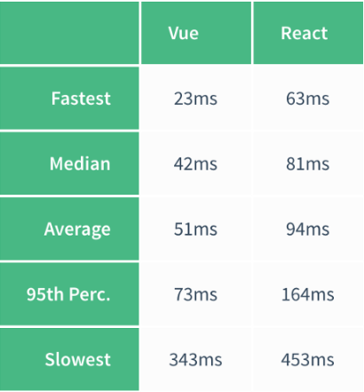
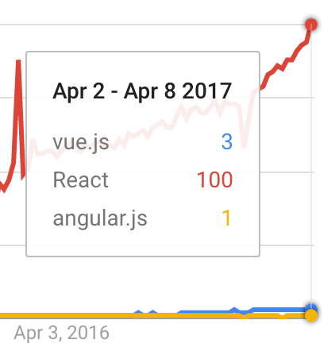
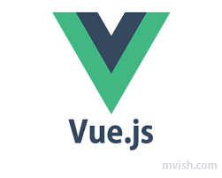

# The Stand Up Kids Guide to Vue
#### “Not a full-blown framework – a view layer that is simple and flexible.” --Vue.js docs

### Getting Started

#### Why Use Vue?

How about an 89% satisfaction rating among developers? We like those odds.

Vue is a lightweight library that is recommended when frameworks like Angular offer more than what is necessary for a single-page application. Part of the beauty of Vue is its simplicity; it is designed to be adoptable and does not require much configuration with webpack, etc. You simply insert the script tag into your code and you’re ready to use the Vue library.

You can even use Vue on its on without jQuery! Unlike some of the frameworks we have worked with in the past, (aka Rails), this library is not opinionated. This is a great option to use when a small, portable, and fast app. Check out its speed in comparison to React:

You can explore its various options by following their great [documentation](https://vuejs.org/v2/guide/).

#### Who Uses It?

Vue isn't the most popular framework in the world and has slowly fallen behind React's growth rate, but that may change...

As of now React is gaining much more popularity than Vue (according to Google analytics). This might also be attributed to it's age: it's only 3 years old after all!

Aside from vanity stats, let's look at real usage statistics. Vue has passed 1 million downloads on NPM, with a current monthly download count of 120k~150k. This is about 1/4 of Angular and 1/12 of React's monthly downloads. (Watch out, Angular!)

[Here](href="https://github.com/vuejs/awesome-vue#commercial-products") is a link to some of the active sites that implement Vue.

#### How It's Like/Unlike What You Know

#### Code Files (Gemfile, package.json)

#### Pros And Cons Of Vue

#### Hurdles To Learning This Tech

There aren't a ton of roadblocks to learning this technology. The documentation is very developer-friendly and there are dozens of walk-throughs on YouTube. If you have some foundation in Angular, this will look pretty familiar with just a few exceptions.

#### Conclusion

Vue is dope. It's simple, powerful, and has a relatively low barrier to entry if you're already familiar with AngularJS. It may not be your best choice if you need a robust or extensive JavaScript framework, but it gets the job done effectively with single page apps.

You can build a single-page app with [this demo](https://scotch.io/tutorials/build-an-app-with-vue-js-a-lightweight-alternative-to-angularjs). Have fun!

